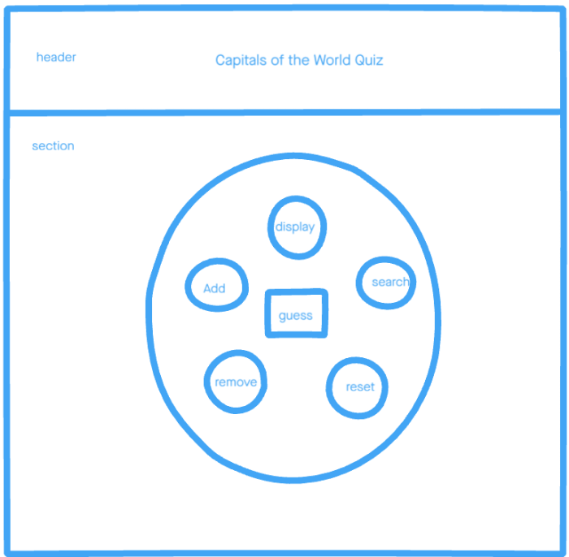

# Development Strategy

> `Capitals of the World Quiz`

## favorite-words

A basic web page aim to learn JavaScript, testing and developed collaboratively using branches.

## Wireframe

## 0. Set-Up

**A User can see my initial repository and live demo**

### Repository

- Created a new repository from this [template](https://github.com/HackYourFutureBelgium/testing-module-project-boilerplate)
- Clone the repository
- Write initial, basic README
- Add a wireframe
- Start the development strategy
- Prepare a project board
- Push the changes to GitHub
- Turn on GitHub Page

## 1. Display Countries and Capitals

**As a site visitor, I want to see all countries and cities when I click the display button.**

> assigned to Mamé

### Repo

This user story has been developed through a branch called 'display'.

### HTML

- Nothing has changed

### CSS

- Nothing has changed

### javascript

- Used chai javascript test framework
- Tested many possibilities and passed
- Wrote logic for testing
- Display all countries and capitals via display handler

## 2. Guess

**As a site visitor, I want to play by trying to guess the country's capital**

> assigned to Eltayeb

### Repo

This user story has been developed through a branch called 'guess'.

### HTML

No html markup has been added on this user story.

### CSS

No styling has been added.

### javascript

- Write the Guess function logic.
- Add Test to verify if the guess function work correctly.
- Write the guessHandler.

## 3. Style Web Page

**As a site visitor, I want to see a website with all the necessary buttons and with a stand out style.**

> assigned to Mamé

### Repo

This user story has been developed through a branch called 'stylee'.

### HTML

- Added Button tags
- Add Header and Section tag
- Added div tags and place bootstrap classes

### CSS

- Styled button and div tags
- Added CSS properties in style file

### javascript

- Change buttons border colors randomly

## 4. Reset Database

**As a site visitor, I want to reset the database.**

> assigned to Mamé

### Repo

This user story has been developed through a branch called 'reset'.

### HTML

- Nothing has changed

### CSS

- Nothing has changed

### javascript

- Called reset handler function
- Reset shared global variable

## 5. Remove Countries from Database

**As a site visitor, I want to remove some countries info from the database.**

> assigned to Mamé

### Repo

This user story has been developed through a branch called 'remove'.

### HTML

- Nothing has changed

### CSS

- Nothing has changed

### javascript

- Called remove handler function
- wrote logic to remove countries from database.

## 6. Search countries

**As a site visitor, I want to search for countries by their name or some matching characters.**

> assigned to Miroslav

### Repo

This user story has been developed through a branch called 'search'.

### HTML

- Nothing has changed

### CSS

- Nothing has changed

### JavaScript

- Write _searchCountryHandler_ function with logic to handle user input
- Connect the function with _displayHandler_ to show the end result to the user
